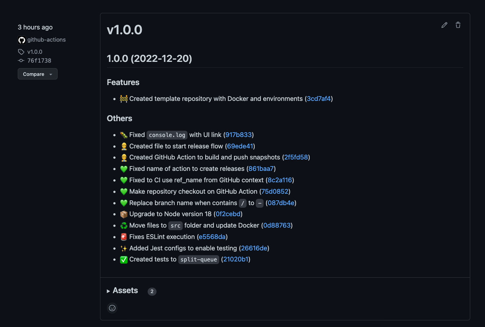
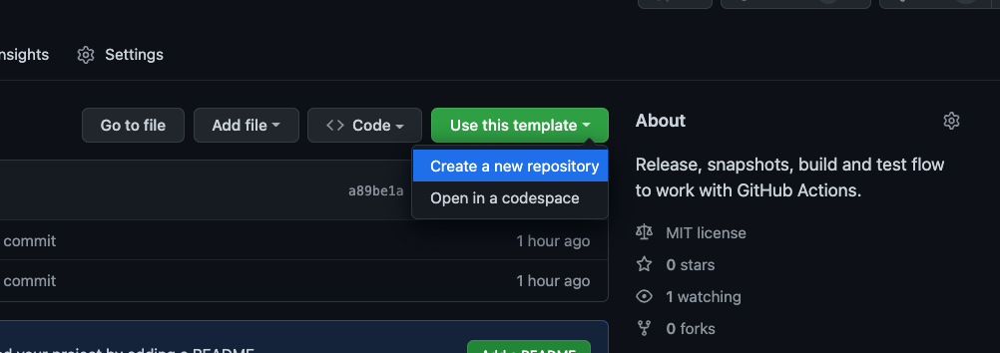

# NodeJS flow to GitHub Actions

  
  

**Complete CI/CD flow to work with GitHub Actions.**

_For now the workflows work only for repositories with the `master/main` branch. If you are working with `develop` and created something, please send a PR._

> This repository it's a template with the configurations for Release It package.

## Resources

- Auto generate releases on repository;
- Auto create tags on repository;
- Auto create changelog on repository;
- Auto commit and push changes on repository;
- Handle `version` property on `package.json` file;
- Build and push Docker image to Docker Hub (you can use Docker or not, remove theses steps on workflow files);
- Publish packages to NPM (disabled by default. You will ned to change some things.)

### Workflow files

| Type            | File                             | Description                                                                                                                                      |
| --------------- | -------------------------------- | ------------------------------------------------------------------------------------------------------------------------------------------------ |
| Create releases | `.github/workflows/release.yml`  | Create pre-releases and releases. Needs to be dispatch via GitHub interface and fill some fields. Create tag, changelog, release and push image. |
| Snapshots       | `.github/workflows/snapshot.yml` | Create snapshot versions to test changes in any branch/PR. Always triggered.                                                                     |
| Build           | `.github/workflows/build.yml`    | Build and test app, running default NodeJS process steps.                                                                                        |

## Examples

- [Docker Hub image](https://hub.docker.com/repository/docker/tiagoboeing/nodejs-github-actions)
- [NPM package](https://www.npmjs.com/package/@tiagoboeing/nodejs-github-actions)
- [Releases page](https://github.com/tiagoboeing/nodejs-github-actions/releases)
- [Tags](https://github.com/tiagoboeing/nodejs-github-actions/tags)
- [Changelog](https://github.com/tiagoboeing/nodejs-github-actions/blob/master/CHANGELOG)

## Notes

This repository is template with all configurations for the package [`release-it`](https://github.com/release-it/release-it/). Bugs or questions about needs to be opened on the original repository.

## Starting

Simply use this template to create a new repository and start working on your project:

_Click on "Use this template > Create a new repository"._

1. Go to `package.json` and change `version` property to `0.0.0`;
   1. Change other properties like `repository`, `author`, `license`, etc.
2. Change the Docker properties to your project name (or remove the files if you don't need Docker);
   1. Create two secrets on repository: `DOCKERHUB_USERNAME` and `DOCKERHUB_TOKEN` ([how to create access token docs](https://docs.docker.com/docker-hub/access-tokens/));
3. Create a secret called `NPM_TOKEN` if you desire to publish your package to NPM;
4. Go to `.github/workflows/` folder and replace with your project settings;
5. Done ✅

# License

The original project is licensed under [MIT License](https://github.com/tiagoboeing/nodejs-github-actions/blob/master/LICENSE), so it means it's completely free to use and copy. I decided to keep this available for all and free keeping the same license as the original on this repository and respecting the original creators.
